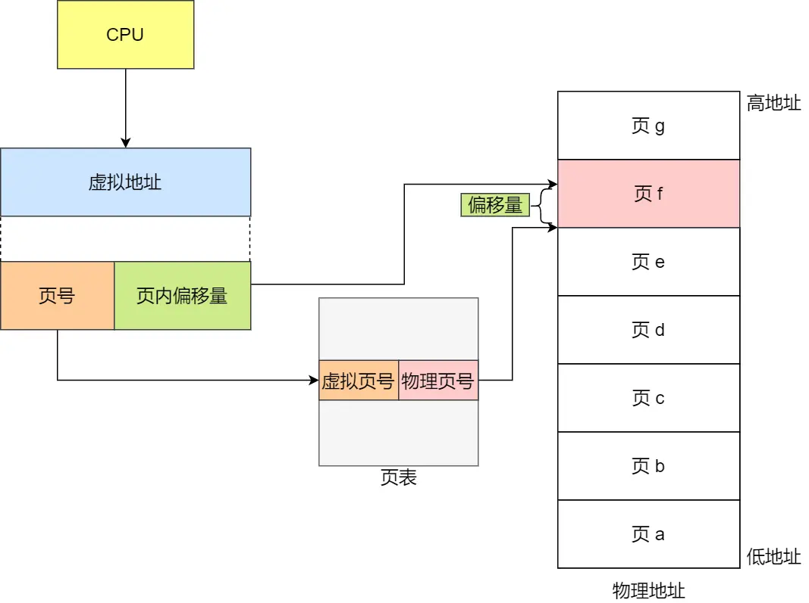
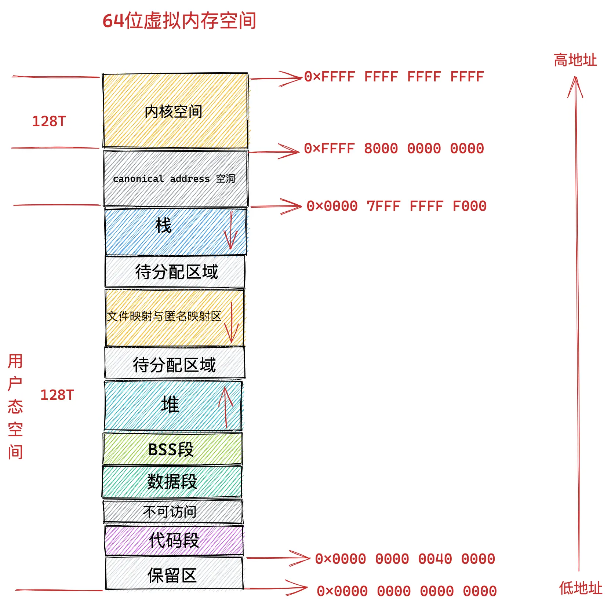

## 分段


- 段选择子就保存在段寄存器里面。段选择子里面最重要的是段号，用作段表的索引。段表里面保存的是这个段的基地址、段的界限和特权等级等。


## 分页




## Linux 内存布局


- 32 位机器上进程虚拟内存空间分布

- 64 位机器上进程虚拟内存空间分布


## 内核内存管理实现
```c
struct task_struct {
        // 进程id
	    pid_t				pid;
        // 用于标识线程所属的进程 pid
	    pid_t				tgid;
        // 进程打开的文件信息
        struct files_struct		*files;
        // 内存描述符表示进程虚拟地址空间
        struct mm_struct		*mm;

        .......... 省略 .......
}
```
当我们调用 fork() 函数创建进程的时候，表示进程地址空间的 mm_struct 结构会随着进程描述符 task_struct 的创建而创建。
```mermaid
graph LR
    A[_do_fork]-->B[copy_process]
    B-->C[copy_mm]
```
内核线程和用户态线程的区别就是内核线程没有相关的内存描述符 mm_struct ，内核线程对应的 task_struct 结构中的 mm 域指向 Null，所以内核线程之间调度是不涉及地址空间切换的。

## 内核如何划分用户态和内核态虚拟内存空间
task_size 定义了用户态地址空间与内核态地址空间之间的分界线。
```c
struct mm_struct {
    unsigned long task_size;	/* size of task vm space */
}
```
32 位系统中用户地址空间和内核地址空间的分界线在 0xC000 000 地址处，那么自然进程的 mm_struct 结构中的 task_size 为 0xC000 000。
