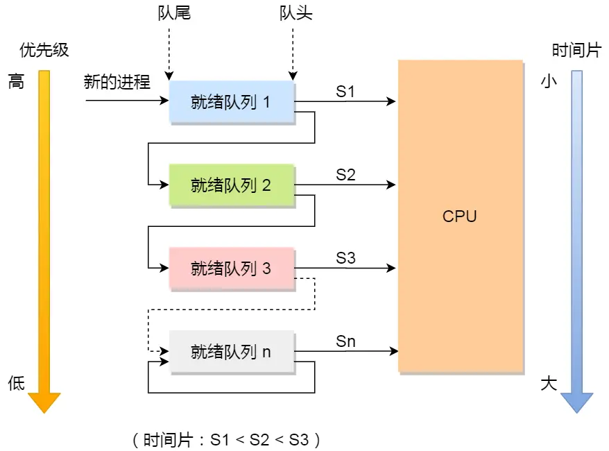

## FCFS

## 时间片轮转

- 每个进程得到相同CPU时间(time slice)
- 抢占式调度算法

## 最短作业优先 (Shortest Job First)

## 优先级调度 (PRIORITY)

## 高响应比优先调度算法
高响应比优先调度算法是「理想型」的调度算法，现实中是实现不了的。

## 多级反馈队列调度算法

- 设置了多个队列，赋予每个队列不同的优先级，每个队列优先级从高到低，同时优先级越高时间片越短；
- 新的进程会被放入到第一级队列的末尾，按先来先服务的原则排队等待被调度，如果在第一级队列规定的时间片没运行完成，则将其转入到第二级队列的末尾，以此类推，直至完成；
- 当较高优先级的队列为空，才调度较低优先级的队列中的进程运行。如果进程运行时，有新进程进入较高优先级的队列，则停止当前运行的进程并将其移入到原队列末尾，接着让较高优先级的进程运行；