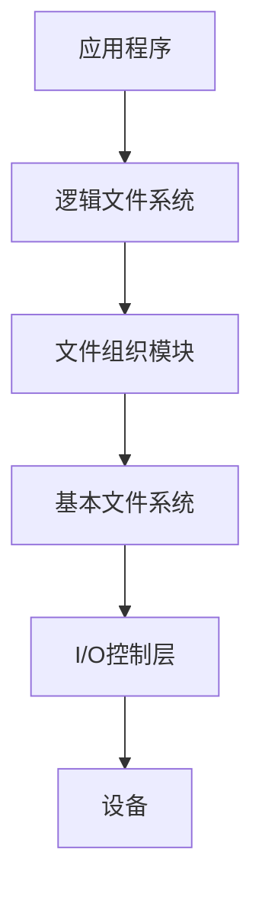
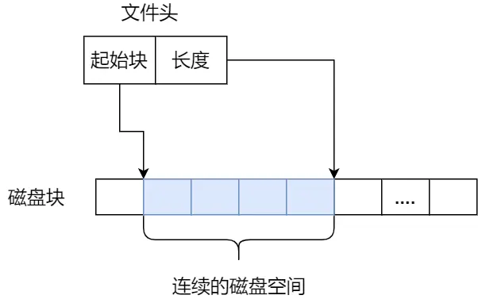
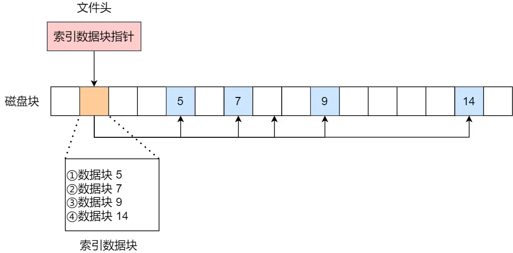
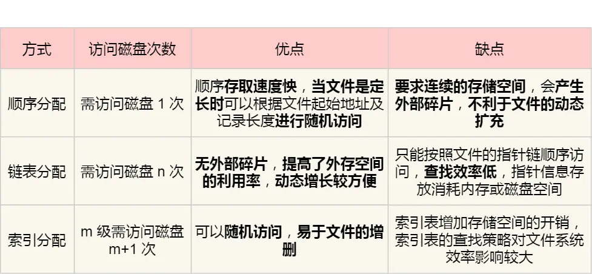
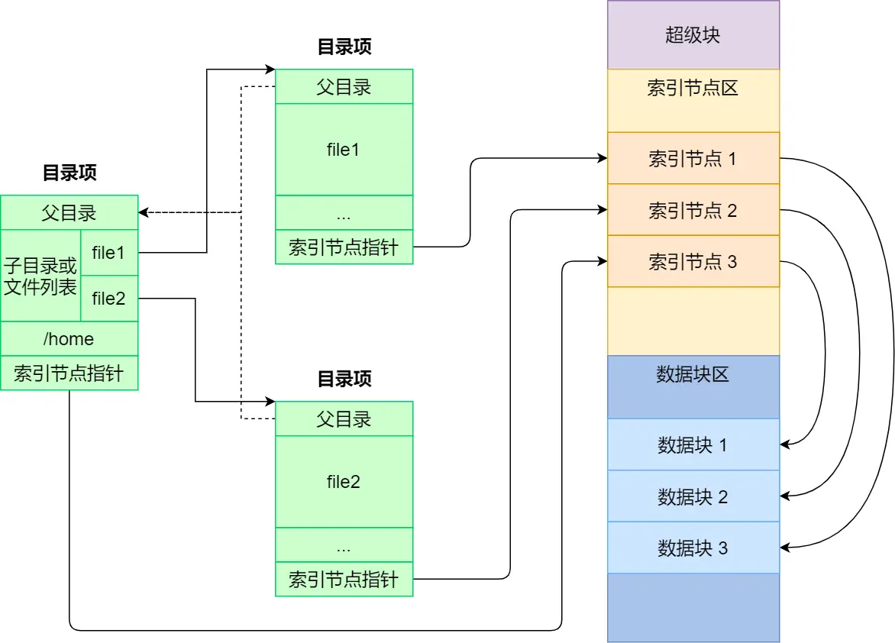
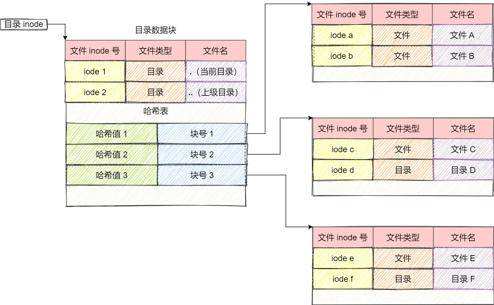

## 文件系统层次
从底到高
1. 对象及其属性
有文件,目录,磁盘
2. 软件集合
分层

3. 接口

## 文件的数据结构
一个FCB就是一个文件目录项
FCB的有序集合称为"文件目录"
FCB主要记录⽤来记录⽂件的名字，**索引节点指针**以及其他⽬录项的层级关联关系

- 索引节点 (简称i结点 inode)
索引结点分为了
1、磁盘索引结点
指存放在磁盘上的索引节点，每个文件有一个唯一的磁盘索引节点
2、内存索引结点
指存放在内存中的索引节点，⽂件打开后，将磁盘索引节点复制到内存中

## 文件的逻辑结构
- 无结构文件
文件内部的数据就是一系列二进制流或字符流组成。又称“流式文件”。
- 顺序文件
- 索引文件
- 索引顺序文件

## 文件的物理结构
- 连续分配

- 链接分配
1、隐式链接

2、显示链接

- 索引分配


## 外存空闲空间管理
1. 空闲表法

2. 空闲链表法
3. 位视图法
4. 成组链接法


## 软硬链接

1. 
```
 Linux 硬链接是一种文件系统中的链接类型，它允许多个文件名指向同一个物理文件。硬链接与原始文件共享相同的inode和数据块，因此它们在文件系统中占用的空间相同。
 硬链接的使用情景有以下几个方面：
 1. 文件备份：通过创建硬链接，可以在不复制文件的情况下创建文件的备份。当原始文件更改时，备份文件仍然保持同步。
 2. 共享文件：多个用户之间可以通过硬链接共享文件。这对于团队合作和共享资源非常有用。
 3. 节省磁盘空间：硬链接允许多个文件名指向同一个文件，这可以节省磁盘空间。当你需要多个文件名指向相同的内容时，使用硬链接比复制文件更有效。
 需要注意的是，硬链接只能在同一文件系统中使用。另外，删除原始文件并不会影响硬链接，只有当所有硬链接都被删除后，文件的存储空间才会被释放。
 ```
 2. 
 ```
 软链接（Symbolic Link）是一种指向目标文件或目录的特殊文件，类似于Windows系统中的快捷方式。与硬链接不同，软链接是一个指向目标文件的符号引用，而不是共享相同的inode和数据块。
 软链接的使用前景如下：
1. 跨文件系统链接：软链接可以跨越不同的文件系统，允许在不同的存储设备之间创建链接。
2. 管理软件包：在Linux系统中，软链接常用于管理软件包。例如，将可执行文件放在/usr/bin目录下的软链接，可以使得在任何位置都可以通过执行该软链接来运行该程序。
3. 管理共享库：软链接还可以用于管理共享库文件。通过在/usr/lib目录下创建共享库的软链接，可以使得不同的程序都可以共享同一个库文件。
4. 管理配置文件：软链接可以用于管理配置文件。例如，将一个公共的配置文件放在一个位置，并在各个用户的配置文件目录下创建软链接，可以实现统一的配置管理。
 需要注意的是，软链接在删除原始文件或目录时会失效，而硬链接不会。此外，软链接相对于硬链接会占用更多的存储空间，因为它需要额外的元数据来存储目标文件的路径信息。
 ```

 ## Linux文件系统
Linux 文件系统会为每个文件分配两个数据结构：索引节点（index node）和目录项（directory entry）
- 索引节点，也就是 inode，用来记录文件的元信息.
- 目录项，也就是 dentry，用来记录文件的名字、索引节点指针以及与其他目录项的层级关联关系。目录项是由内核维护的一个数据结构，不存放于磁盘，而是缓存在内存。

```ad-note
title: 目录项和目录是一个东西吗？
目录是个文件，持久化存储在磁盘，而目录项是内核一个数据结构，缓存在内存。
```

文件系统把多个扇区组成了一个逻辑块，每次读写的最小单位就是逻辑块（数据块），Linux 中的逻辑块大小为 4KB.


磁盘
- 超级块，用来存储文件系统的详细信息，比如块个数、块大小、空闲块等等。当文件系统挂载时进入内存；
- 索引节点区，用来存储索引节点；
- 数据块区，用来存储文件或目录数据；当文件被访问时进入内存；

## 文件的使用

我们打开了一个文件后,操作系统为每个进程维护一个打开文件表，文件表里的每一项代表「文件描述符」.
操作系统在打开文件表中维护着打开文件的状态和信息：
- 文件指针
- 文件打开计数器
- 文件磁盘位置
- 访问权限

## 目录

