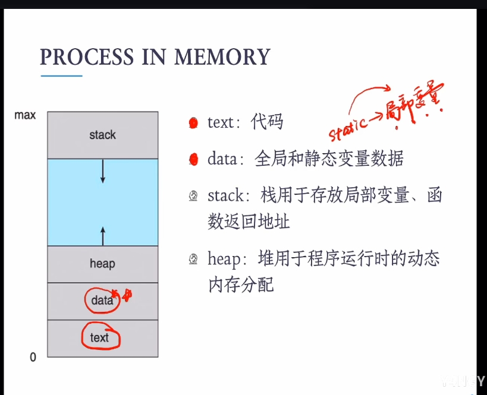
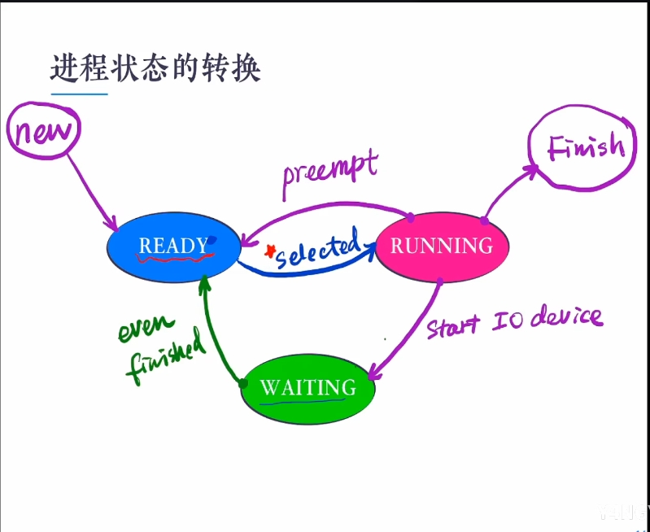

## 内容

- 定义
- 状态

## 什么是进程process,程序program

- A program is a passive entity(被动实体),such as a file containing a list of instructions stored on disk( oftencalled an executable file)
- A program becomes a process when an executable file is loaded into memory
- A process is an active entity,with a program counter specifying the next instruction to execute an a set of associated resources

## process in memory

source code -> binary code
                load 

- text     代码  read only
- data     全局和静态
- stack    局部,函数返回地址
- heap     动态内存分配

## 并发

- Concurrency  : the fact of two or more event or circumstances happening or existing at the seam time
- 并行区别  running
- 进程并发的动机 : 多道程序设计

## 进程的定义

- 一个程序一次执行的过程
- 是资源分配,保护和调度的基本单位

## process state

- new
- Running   单处理器only one 
- Ready     
- Waiting       
- finish

## 进程何时离开CPU

- 内部事件
    - 进程主动放弃(yield)  
    - eg 使用I/O,(非)正常结束
- 外部
    - 被剥夺   (preempt)
    - eg 时间片到达,高优先级进程到达

下期预告
PCB,Queue,contect switch