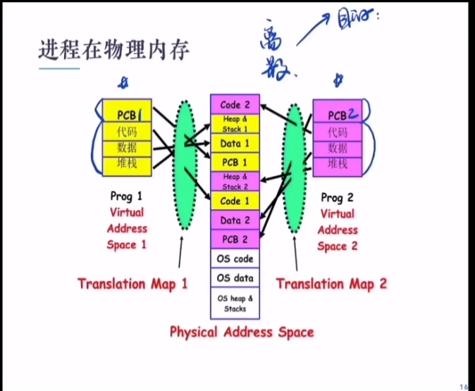

## process switchs

并发进程的切换

1. 什么出发了进程切换
2. 进程切换要做什么

## 中断源

- 外中断    interrupt  计组学的
    - 均是异步中断
- 内中断    exception   属同步中断
    - 硬件异常:掉电,奇偶校验错误
    - 程序异常:非法操作,地址越界,断点,除数为0
    - 系统调用

## 中断处理过程

## 特权指令和非特权指令

- Privileged Instructions
    - The Instructions that can run only in Kernel Mode 
        - I/O instructions and Halt instructions
        - Turn off all Interrupt
        - set the Timer
        - Process Switch

- Non-Privileged Instructions
    - The Instruction that can run only in User Mode 

## 模式切换

- 中断中用户态向核心态转换的**唯一**途径
- OS提供Load PSW 指令装载用户进程返回用户状态

## 进程切换

- 切换时机
    - 进程需要进入等待状态
    - 进程被抢占CPU 进入就绪状态

- 切换过程
    - user mode -> kernel mode
    - save Context
    - 修改被中断进程的控制信息
    - 将被中断的进程加入响应的状态队列
    - 调度一个新的进程并恢复它的上下文信息

## 进程控制块

- A Process Control Block (PCB) contains many pieces of information associated with a specific process

eg 

|process state|
|---|
|process number|
|PC|
|registers|
|memory limits|
|list of open files|
|...|

## 进程在物理内存

## 进程队列
只对PCB管理

Ready Queues

Wait Queues 不同I/O有不同等待队列

## 进程调度

调度器 (scheduler)

