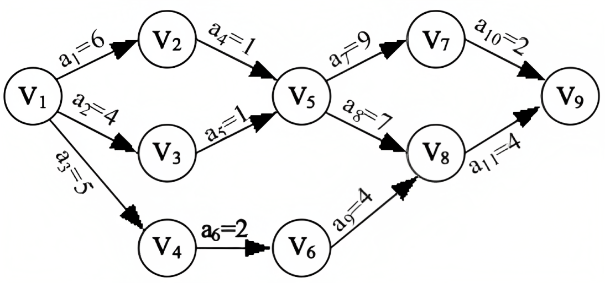

## 构造拓扑序列步骤

1. 从图中选择一个入度为零的点。
2. 输出该顶点，从图中删除此顶点及其所有的出边。

## 关键路径和 AOE 网

基本概念:
- 活动：AOE 网中，弧表示活动。弧的权值表示活动持续的时间，活动在其前驱事件（即该弧的起点）被触发后开始。
- 事件：AOE 网中，顶点表示事件，事件在它的所有前驱活动（即指向该边的弧）全部完成被触发。
- 关键路径：AOE 网中从源点到汇点的最长路径的长度。
- 关键活动：即关键路径上的活动，它的最早开始时间和最迟开始时间相等。

四个描述量:
1. 事件$v_i$最早发生时间
2. 事件的最晚发生时间
3. 活动的最早开工时间
4. 活动的最晚开工时间