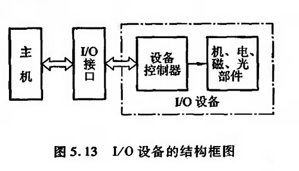

## I/O设备
---
大致可分为3类

1. 人机交互设备
2. 计算机信息的存储设备
3. 机-机通信设备

本节主要介绍人机交互设备,可分为输人设备和输出设备两种,并且有的设备既具有输人功能,又具有输出功能。

关于存储设备已在第4章介绍过,有关机-机通信设备将在“计算机网络”课程中讲述。

### 输入设备

1. 键盘
2. 鼠标
3. 触摸屏

### 输出设备

1. 显示设备

### 其他I/O设备

```ad-note
title: 终端设备
collapse: closed
终端是由显示器和键盘组成的一套独立完整的I/O设备,它可以通过标准接口接到远离主机的地方使用。终端与显示器是两个不同的概念,终端的结构比显示器复杂,它能完成显示控制与存储、键盘管理及通信控制等,还可完成简单的编辑操作。
```

## I/O 接口

接口可以看做是两个系统或两个部件之间的交接部分,它既可以是两种硬设备之间的连接电路,也可以是两个软件之间的共同逻辑边界。

I/O接口通常是指主机与I/O设备之间设置的一个硬件电路及其相应的**软件**控制。由图5.13可知,
不同的I/O设备都有其相应的设备控制器,而它们往往都是通过I/O接口与主机取得联系的。

```ad-note
title: 接口与端口
值得注意的是,接口(Interface)和端口(Port)是两个不同的概念。端口是指接口电路中的一些寄存器,这些寄存器分别用来存放数据信息、控制信息和状态信息,相应的端口分别称为数据端口、控制端口和状态端口。若干个端口加上相应的控制逻辑才能组成接口。CPU 通过输人指令,从端口读人信息,通过输出指令,可将信息写人到端口中。
```

## I/O 软件层次结构

1. 用户层
通常大部分的I/O 软件都在操作系统内核,但仍有一小部分在用户层,包括与用户程序链接在一起的库函数。用户层I/O 软件必须通过一组系统调用来获取操作系统服务。
2. 设备独立性软件 设备独立性也称设备无关性,
3. 设备驱动程序
与硬件直接相关,每类设备需要配置一个设备驱动程序。设备驱动程序负责具体实现系统对 设备发出的操作指令,驱动 I/O 设备工作的驱动程序,它是I/O 进程与设备控制器之间的通信程 序,通常以进程的形式存在。
4. 中断处理程序

## 