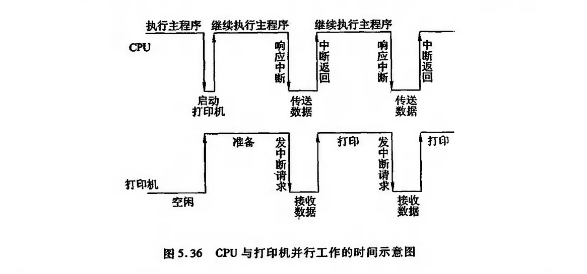
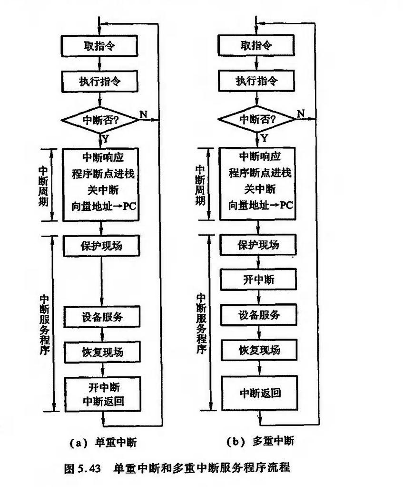

# 程序中断方式

## 中断的产生

下图是CPU与打印机并行工作的时间示意图

引入中断不仅是为了适应I/O设备工作速度低的问题,也为了应对一切突发事件,例如掉电,响应.

## 程序中断方式的接口电路

1. 中断请求触发器和中断屏蔽触发器

2. 排队器

3. 中断向量地址形成部件 (设备编码器)

## I/O中断处理过程

1. CPU 响应中断的条件和时间

CPU响应I/O设备提出中断请求的条件是必须满足CPU中的允许中断触发器EINT为“1”。

该触发器可用开中断指令置位(称为开中断);

也可用关中断指令或硬件自动使其复位(称为关中断)。

CPU在每条指令执行阶段结束前向接口发出中断查询信号,以获得I/O中断请求.

2. I/O中断处理过程

可将一次中断处理过程简单地归纳为中断请求、中断判优、中断响应、中断服务和中断返回5个阶段。

## 中断服务程序的流程

- 保护现场

- 中断服务 (主体)

- 恢复现场

- 中断返回

