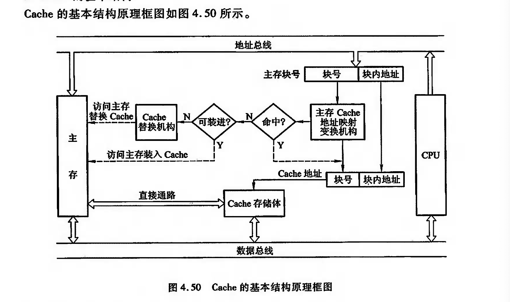
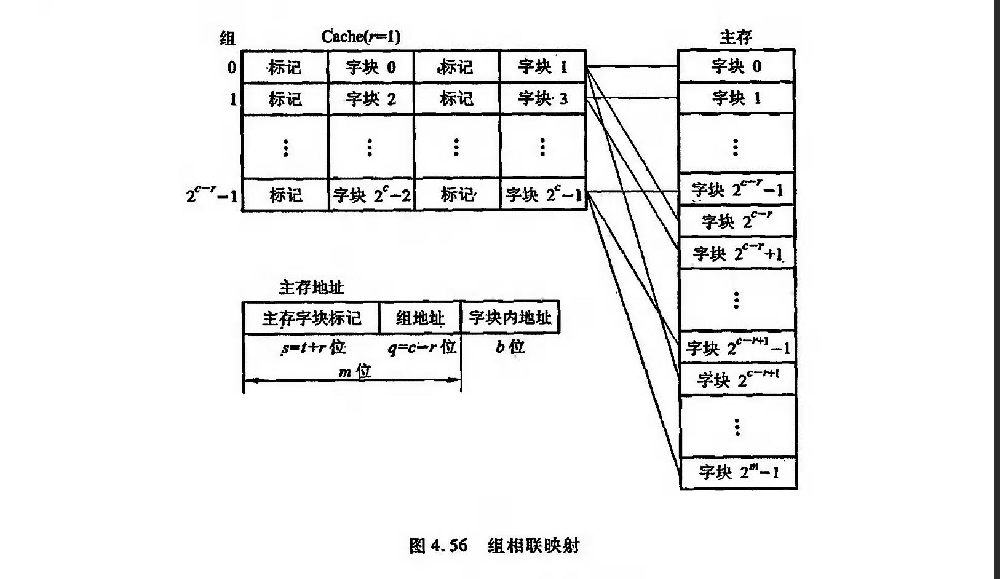

# Cache


## Cache 的基本结构




## Cache--主存地址映射
### 直接映射


图中每个主存块只与一个缓存块对应,映射关系式为

$$i=j \bmod C \qquad 或 \qquad i=j \bmod 2^c$$

- i为缓存块号
- j为主存块号
- C为缓存块数

### 全相联映射

全相联映射允许主存中的每一字块映射到Cache中的任何一块位置上.

与直接映射相比,它的主存字块标记从t位增加到t+c位,这就使得Cache“标记”的位数增多,而且访问Cache时主存字块标记需要和Cache的全部标记位进行比较,才能判断出所访问的主存地址内容是否已在Cache中.

这种比较通常采用“按内容寻址”的相联存储器来完成.

```ad-note
title: 相联存储器

pass
```

### 组相联映射

它把Cache分为Q组,每组有R块,并有以下关系:

$i = j \bmod Q$

- i为缓存的组号
- j为主存的块号

某一主存按模Q将其映射到缓存的第i组,如图



```ad-example
title: 例子
假设c=5,q=4,则r=c-q=1.

实际含义为:Cache共有$2^c=32$个字块,共分为$2^q=16$组,每组包含2块.

组内2块的组相连映射又称为二路组相联
```

当r=0时是直接映射方式

当r=c时时全相联映射方式

## 替换策略

1. 先进先出
2. 近期最少使用
3. 随机法
[[CRC码|CRC码]]


