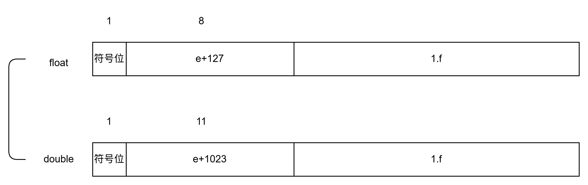

# 二进制

## IEEE754

3. 数值类型
- 规格化数 (Normalized Numbers): (0 < e < max) - 最常见的数字
- 非规格化数 (Subnormal / Denormalized Numbers): (e = 0, f != 0) - 用于表示非常接近零的数，提供渐进下溢
- 零 (Zero): (e = 0, f = 0)
- 无穷大 (Infinity): (e = max, f = 0)
- NaN (Not a Number): (e = max, f != 0)

## 浮点数加减法
1. 对阶 右移时，移出的位需要保留
2. 尾数加减
3. 规格化 左右规
4. 舍入

- 右规和尾数舍入。数值很大的尾数舍入时,可能因为末位加1 而发生尾数溢出,此时需要通过右规来调整尾数和阶码。右规时阶码加1,导致阶码增大,因此需要判断是否发生了指数上溢。
- 左规。左规时阶码减1,导致阶码减小,因此需要判断是否发生了指数下溢。其判断规则与指数上溢类似,左规一次,阶码减1,然后判断阶码是否为全0来确定指数是否下溢。

## 大小端
有一个 4 字节整数 0x12345678
大端
内存地址:   0x00   0x01   0x02   0x03
内容:      0x12   0x34   0x56   0x78
小端:
内存地址:   0x00   0x01   0x02   0x03
内容:      0x78   0x56   0x34   0x12

- 网络传输使用大端（网络字节序）

- 大多数 x86/x64 处理器使用小端

- 某些嵌入式平台（如某些 ARM、PowerPC）可以切换端序

## 对齐
编译器要使结构体成员在空间上对齐。为此必须满足:
①每个成员存储的“起始地址%该成员的长度 = 0”,而结构体中的成员都是按定义的先后顺序排放
的。
②结构体的长度也必须是最大成员长度的整数倍,即结构体也要对齐排放。

## 定点数加减运算
补码定点数加减运算溢出判断的方法有3种。
1. 采用一位符号位
2. 采用双符号位
3. 采用一位符号位根据数值位的进位情况判断溢出

## 加法器
标志信息

大小比较

## 定点数乘法
