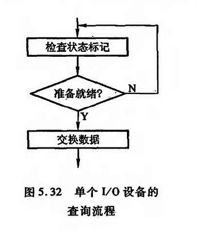
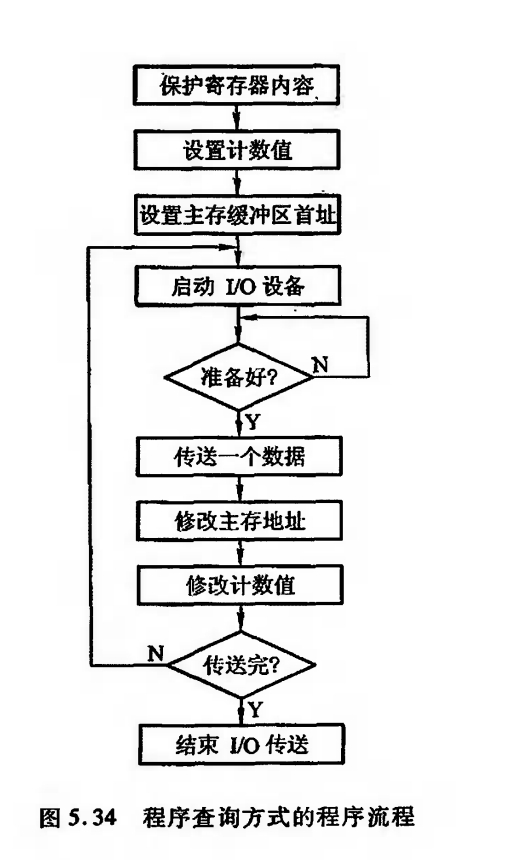
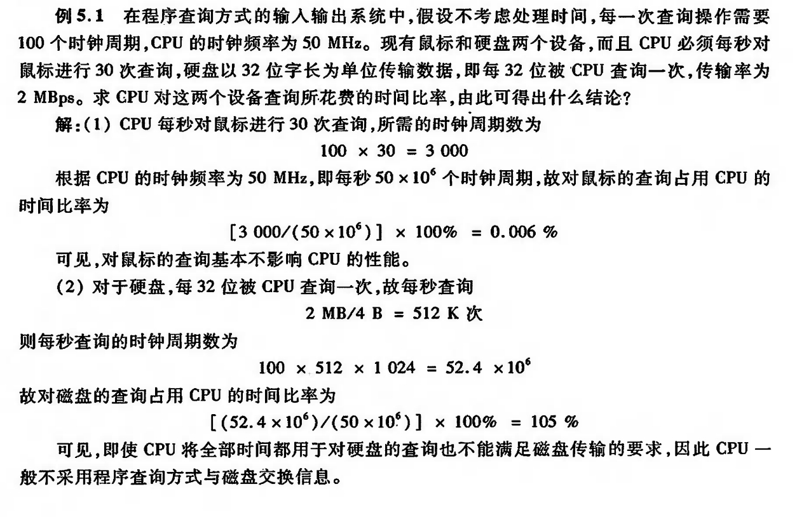

# 程序查询方式


```ad-note
title: x86 I/O指令实例
collapse: closed
```
    
    
    IN Rd,Rs : 把I/O端口Rs的数据输入到CPU寄存器Rd
    
    OUT Rd,Rs: 把CPU寄存器Rs的数据输出到I/O端口Rd

## 程序查询流程


图5.32是单个I/0设备的查询流程。




```ad-note
title: 指令
为了正确完成这种查询,通常要执行如下3条指令
```
    
    1. 测试指令,用来查询 I/0 设备是否准备就绪。

    2. 传送指令,当I/0设备已准备就绪时,执行传送指令

    3. 转移指令,若I/0设备未准备就绪,执行转移指令,转至测试指令,继续测试 I/0 设备的状态。

图5.34所示为单个I/O设备程序查询方式的程序流程。
当需要启动某一I/O设备时,必须将该程序插人到现行程序中。
该程序包括如下几项,其中①~③为准备工作。



```ad-tip
title: 描述
collapse: closed

①由于这种方式传送数据时要占用CPU中的寄存器,故首先需将寄存器原内容保护起来(若该寄存器中存有有用信息)。

②由于传送往往是一批数据,因此需先设置I/O设备与主机交换数据的计数值。

③设置欲传送数据在主存缓冲区的首地址。

④ CPU 启动 I/O 设备。
```
    
    ⑤将 I/O接口中的设备状态标志取至 CPU并测试
    
    ⑥CPU执行 I/0指令,或从 I/0接口的数据缓冲寄存器中读出一个数据,或把一个数据写人I/O接口中的数据缓冲寄存器内,同时将接口中的状态标志复位。
    
    ⑦ 修改主存地址。
    
    ⑧ 修改计数值

    ⑨ 判断计数值。若计数值不为0,表示一批数据尚未传送完,重新启动外设继续传送;若计数值为0,则表示一批数据已传送完毕。
    
    ⑩ 结束 I/0传送,继续执行现行程序。

## 程序查询方式的接口电路

```ad-example
title: 例题
collapse: closed
```
