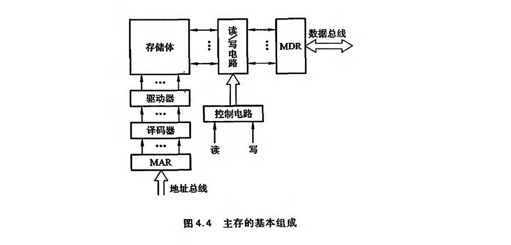
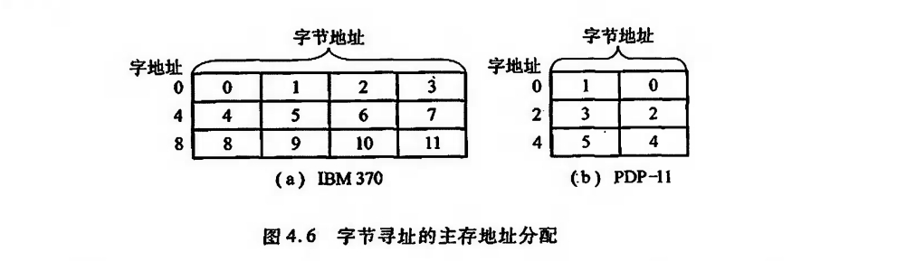
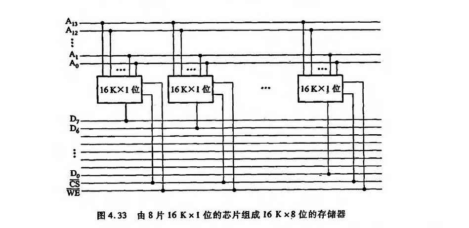
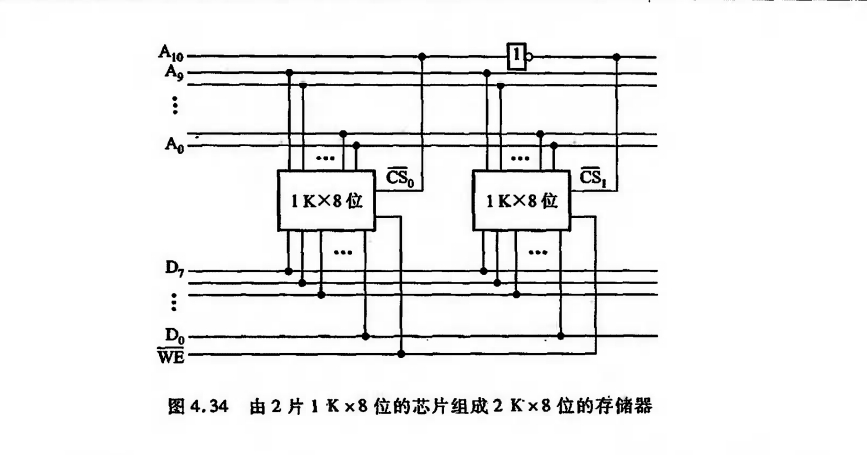
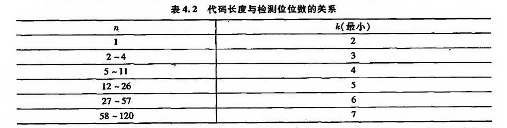

# 主存储器

## 概述

!!! note "MDR : memory data register"

!!! note "MAR : memory address register"

1. 主存中存储单元地址的分配

2. 主存的技术指标

主要是容量与速度

- 存储容量
- 存储速度

    - 存取时间  指启动一次存储器操作到完成所需的全部时间 
    - 存取周期  指进行连续两次独立存储器操作所需的最小间隔时间

- 存储器带宽

## 随机存续存储器

按存储信息的原理不同

### 静态RAM (Static RAM,SRAM)

由于静态RAM是用触发器工作原理存储信息,因此即使信息读出后,它仍保持其原状态不需要再生。但电源掉电时,原存信息丢失,故它属易失性半导体存储器。

###　动态RAM (Dynamic RAM,DRAM)

常见的动态RAM基本单元电路有三管式和单管式两种,它们的共同特点都是靠电容存储电荷的原理来寄存信息。若电容上存有足够多的电荷表示存“1”,电容上无电荷表示存“0”。电容上的电荷一般只能维持1~2ms,因此即使电源不掉电,信息也会自动消失。为此,必须在2ms内对其所有存储单元恢复一次原状态,这个过程称为再生或刷新。由于它与静态 RAM 相比,具有集成度更高、功耗更低等特点,目前被各类计算机广泛应用。

## 只读存储器

按ROM的原始定义，一旦注入　原始信息即不能改变，带随着用户需要，总希望能任意修改ROM内的原始信息．这便出现了

- PROM(Programmable ROM)
- EPROM(Erasable Programmable ROM)
- EEPROM(Electrically Erasable Programmable ROM)等.

## 存储器与CPU的连接

### 存储容量的扩展

由于单片存储芯片的容量总是有限的,很难满足实际的需要,因此,必须将若于存储芯片连在一起才能组成足够容量的存储器,称为存储容量的扩展,通常有位扩展和字扩展。

??? note "位扩展"
    
    又如
    

??? note "字扩展"
    
    A_10 作为片选信号

## 存储器的校验

为了能及时变现错误并及时纠正错误,通常可将数据配成汉明码

### 汉明码的组成

汉明码是由Richard Hanming于1950年提出的,它具有一位纠错能力。

由编码纠错理论得知,任何一种编码是否具有检测能力和纠错能力,都与编码的最小距离有关。

!!! note 编码最小距离
    根据纠错理论得:

    \[L-1=D+C \qquad  且D \geq C\]

    - L 编码最小距离
    - D 纠错能力
    - C 检错能力 

设欲检测的二进制代码为n位,为使其具有纠错能力,需增添k位检测位,组成n+k位的代码。为了能准确对错误定位以及指出代码没错,新增添的检测位数k应满足:

\[2^k \geq n+k+1\]

由此关系可求得不同代码长度n所需检测位的位数k,如表4.2所示。

设\(n+k\)位代码自左至右依次编为\(1,2,3,\ldots ,n+k \)位,而将检测码\(C_i(i=1,2,4,\ldots )\),安插在第\(1,2,4,8,\ldots ,2^{k-1}\)位上.

这些检测位的位置设置是为了保证它们不同"小组"的奇偶检测任务.

### 汉明码的纠错过程

详见

[【硬核科普】ECC内存是如何发现错误并纠正的？](https://www.bilibili.com/video/BV1GF411V7sC/?spm_id_from=333.337.search-card.all.click)

## 提高访存速度的措施

除寻找高速元件和采用层次结构外,调整主存结构也行

### 单体多字系统

此时字长小于存储单元,一个存储单元能存多个字.

在一个存取周期内取出多个字,通常有多个指令

### 多体并行系统

多体并行系统就是采用多体模块组成的存储器。每个模块有相同的容量和存取速度,各模块各自都有独立的地址寄存器(MAR)数据寄存器(MDR)、地址译码、驱动电路和读/写电路它们能并行工作,又能交叉工作。

### 高性能存储芯片

1. SDRAN (Synchronous DRAM,同步DRAM)
2. RDRAM (Rambus DRAM)
3. 带Cache的DRAM 

[note /计算机组成原理/docs/ch04存贮器/2]