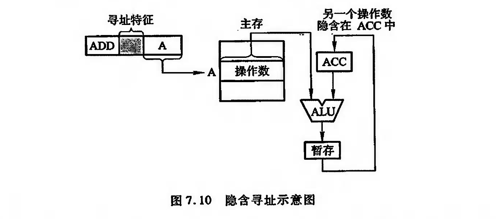
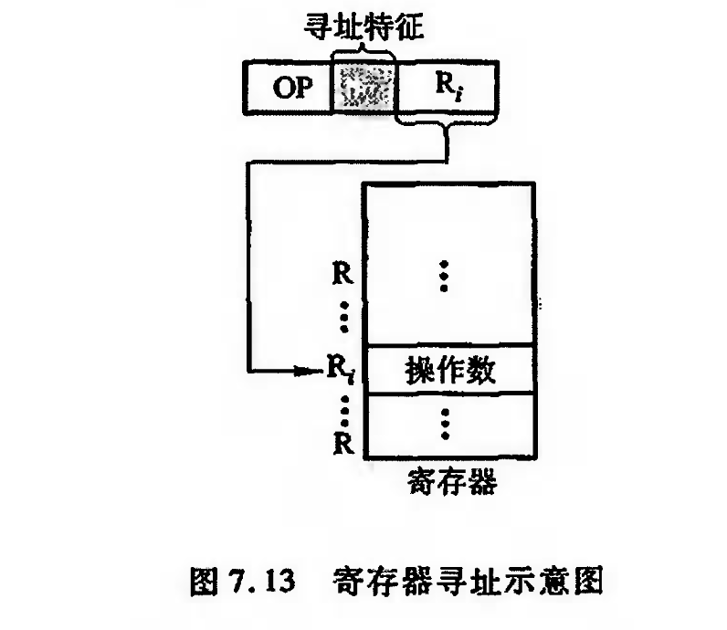
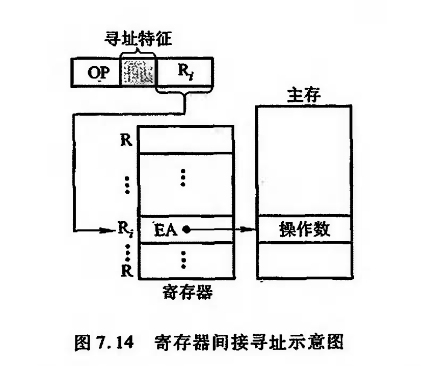
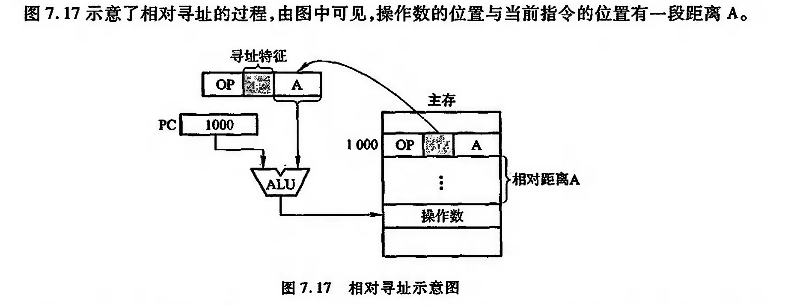

# 指令的寻址方式


## 指令寻址

1. 顺序寻址  即程序计数器PC加一
2. 跳跃寻址 


通过转移类指令实现

至于跳跃寻址的转移地址的形成方式 ,在下面介绍


### 数据寻址

数据寻址的方式较多，为区别各种方式，通常在指令字中设置一个寻址特征字段，用来指明属于哪种寻址方式（其位数决定了寻址方式的种类）。


指令中的地址码字段不代表操作数的真实地址，这种地址被称为形式地址（A）。形式地址结合寻址方式，可以计算出操作数在存储器中的真实地址，这种地址被称为有效地址（EA）

为了便于分析各类寻址方式,假设指令字长,存储字长,机器字长均相同

### 常见的数据寻址方式

```ad-note
title: 隐含寻址
隐含寻址是指指令字中不明显地给出操作数的地址,其操作数的地址隐含在操作码或某个寄存器中。例如,一地址格式的加法指令只给出一个操作数的地址,另一个操作数隐含在累加器ACC 中,这样累加器 ACC 成了另一个数的地址。图 7.10 示意了隐含寻址。

```


```ad-note
title: 直接寻址
直接寻址的特点是，指令字中的形式地址A就是操作数的真实地址区A，即EA=A
```


```ad-note
title: 间接寻址
倘若指令宇中的形式地址不直接指出操作数的地址，而是指出操作数有效地址所在的存储 单元地址，也就是说，有效地址是由形式地址间接提供的，即为间接导址，即区EA=( A)，如图7. 11 所示。

```


```ad-note
title: 立即数寻址

立即数用补码形式存放
```

```ad-note
title: 寄存器寻址
在寄存器寻址的指令字中,地址码字段直接指出了寄存器的编号,即 EA=$R_i$,如图 7.13 所示。

```


```ad-note
title: 寄存器间接寻址

```

```ad-note
title: 相对寻址
相对寻址的有效地址是将程序计数器 PC 的内容(即当前指令的地址)与指令字中的形式地 址 A 相加而成, 即
```
    
    $$EA=(PC)+A$$

    


```ad-note
title: 基址寻址
基址寻址需设有基址奇存器 BR, 其操作数的有效地址EA 等于指令字中的形式地址与基址 寄存器中的内容(称为基地址)相加，即

$$EA=A+(BR)$$

```

    基址寄存器可采用隐式的和显式的两种。所谓隐式，是在计算机内专门设有一个基址寄存 器BR, 使用时用户不必明显指出该基址寄存器，只需由指令的导址特征位反映出基址寻址即可。 显式是在一组通用寄存器里，由用户明确指出哪个奇存器用做基址奇存器，存放基地址。

    IBM370 计算机中设有16 个通用奇存器，用户可任意选中某个寄存器作为基址寄存器。对应图 7.15(a)为隐式基址寻址，图7. 15(6)为显式基址寻址


```ad-note
title: 变址寻址
变址寻址与基址寻址极为相似。其有效地址EA等于指令宇中的形式地址A与变址寄存器 区 的 内 容 相 加 之 和 ，即

$$EA=A+(IX)$$
```

    由于两者的应用场合不同，因此从本质来认识，它们还是有较大的区别。基址寻址主要 用于为程序或数据分配存储空间, 故基址奇存器的内容通常由操作系统或管理程序确定，在程序的执行过程中其值是不可变的，而指令字中的A 是可变的。

    在变址寻址中，变址寄存器的内容 是 由 用 户 设 定 的 ，在 程 序 执 行 过 程 中 其 值 可 变 ， 而 指 令 字 中 的 A 是 不 可 变 的 。 变 址 寻 址指 主 要 用 于 处 理 数 组 问 题 ， 在 数 组 处 理 过 程 中 ，可 设 定 A 为 数 组 的 首 地 址 ，不 断 改 变 变 址 寄 存 器 IX 的 内 容,便可很容易形成数组中任 一数据的地址，特别适合编制循环程序。


```ad-note
title: 堆栈寻址
```

    堆栈寻址要求计算机中设有堆栈。堆栈既可用寄存器组(称为硬堆栈)来实现，也可利用主 存的一部分空间作堆栈( 称为软堆栈) 。堆栈的运行方式为先进后出或先进先出两种，先进后出 型堆栈的操作数只能从一个又进行读或写。

    以软堆栈为例，可用堆栈指针SP ( Stack Point ) 指出 栈项地址，也可用CPU中一个或两个寄存器作为SP。操作数只能从栈项地址指示的存储单元 存或取。可见堆栈寻址也可视为一种隐含寻址，其操作数的地址;总被隐含在SP 中。堆栈寻址就 其本质也可视为寄存器间接寻址，因SP可视为寄存器，它存放着操作数的有效地址。